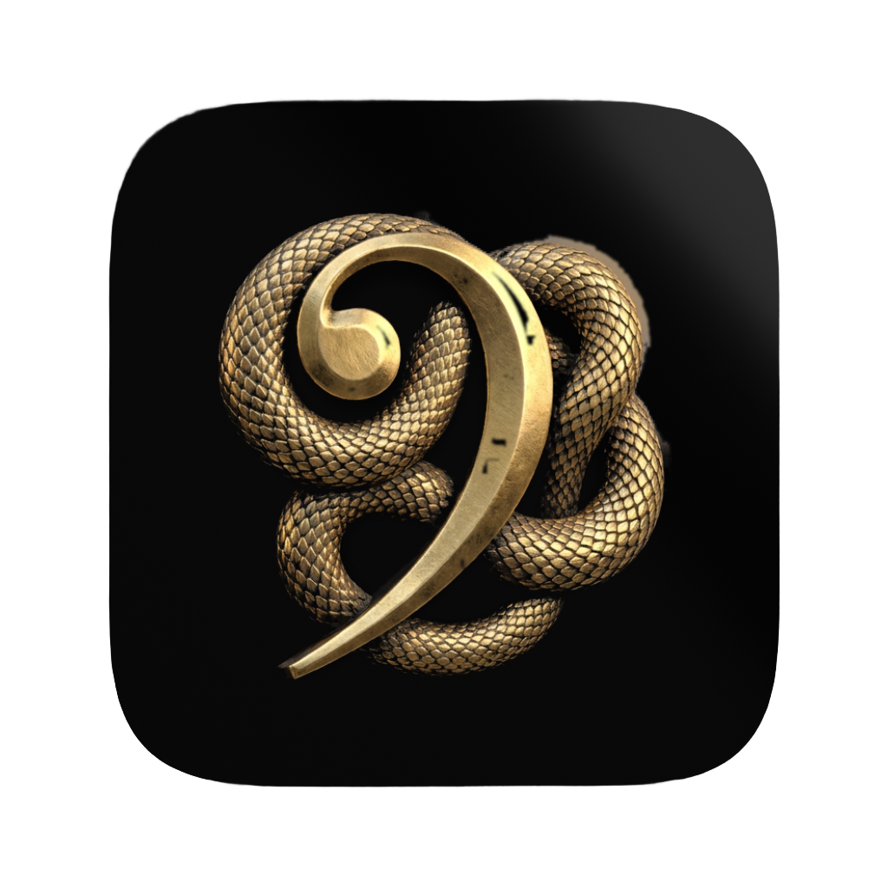
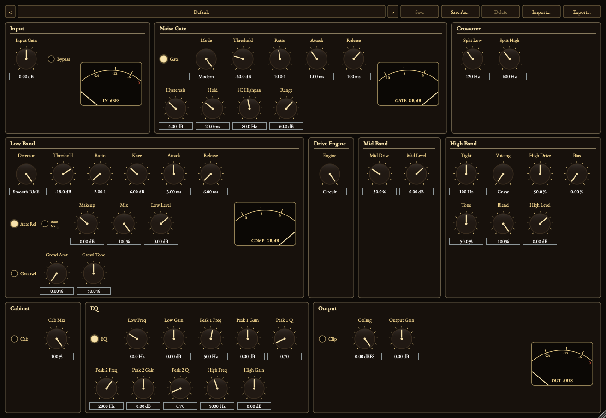

<p align="center"></p>

# Crypta

*Split your bass. Compress the lows. Twist the guts out of the highs.*

> Formerly **Twist Your Guts**, renamed to Crypta as part of the suite's move to Basilica Audio naming (the crypt: the basilica's low-end foundation). If you have a v0.1.0-era session referencing the old plugin identity (`com.yvesvogl.twistyourguts`, plugin code `Tygt`), see the [Unreleased] entry in [`CHANGELOG.md`](CHANGELOG.md) — the new bundle ID and plugin code (`com.yvesvogl.crypta`, `Cryp`) mean DAWs treat this as a new plugin, so existing sessions will need to be re-pointed at the new plugin.

[](https://github.com/basilica-audio/Crypta/actions/workflows/ci.yml)
[](https://www.gnu.org/licenses/agpl-3.0)

> **Work in progress.** Crypta is pre-1.0 and under active development. Binaries for macOS and Windows are published on the [Releases](../../releases) page (macOS builds are signed, notarized and stapled); building from source works too. Expect breaking changes until v1.0.0 ships (see [Roadmap](#roadmap)).

## What it is

Crypta is a Parallax-style bass plugin built on JUCE 8. As of v0.2.0 it splits your bass signal into **three** bands — low, mid, and high — with two cascaded 4th-order Linkwitz-Riley crossovers, compresses the low band in parallel, drives the mid band with staged saturation, and runs the high band through a choice of three distortion voicings before summing everything back together through a 4-band EQ and an impulse-response (cab sim) loader. v0.2.0 also adds a full preset system (factory + user presets, import/export, German localisation). See [`docs/manual.md`](docs/manual.md) for the full parameter reference and usage tips, and [`docs/design-brief.md`](docs/design-brief.md)/[`docs/research-notes.md`](docs/research-notes.md) for the research behind the v0.2.0 topology rebuild.

## Features

- **Noise gate** — full-band, ahead of both crossover splits
- **Two cascaded LR4 crossover splits** — Split Low (60–400 Hz, default 120 Hz) and Split High (300–2000 Hz, default 600 Hz), building a genuine 3-band (low/mid/high) topology, replacing v0.1.x's 2-band split
- **Low band**: parallel "glue" compressor (re-sourced fast/gentle ballistics, ratio 2:1 / attack 3 ms / release 6 ms) with makeup gain, wet/dry mix, and output level
- **Mid band** (NEW): staged/cascaded drive-only saturation, no filter/tone/blend — a distinct "throatier" character separate from the high band
- **High band**: three distortion voicings, oversampled to keep aliasing under control, with a shared, voicing-independent **Tight** pre-drive highpass
- **Circuit drive engine (v0.3.0)**: the mid and high bands rebuilt from circuit models with antiderivative antialiasing, sharing one oversampling region — measured 25–30 dB less aliasing than the previous engine, which ships on as the bit-identical `Classic` fallback
- **Smooth RMS low-band detector and a Modern gate (v0.3.0)**: a log-domain RMS detector that stops the low band tremoloing on sustained notes, and a gate with hysteresis, hold, a sidechain highpass and a straight-line release
  - **Gnaw** — op-amp-style hard clip
  - **Wool** — cascaded soft-clip fuzz with a mid scoop
  - **Razor** — tight overdrive: soft clip, mid hump
  - Clean/distorted blend control, plus drive/tone/output level
- **4-band EQ** post-sum (LowShelf / Peak / Peak / HighShelf), re-anchored default frequencies (80/500/2800/5000 Hz, sourced from the same design lineage's hardware tone stack)
- **IR loader** (cabinet simulation), relocated in v0.2.0 to process only the Mid+High post-sum signal — the low band never passes through it, matching the reference class's own architecture. Convolution engine is live; bundled factory IRs and a GUI file browser land in a later milestone
- **Delay-compensated, phase-aligned signal path** — the Mid+High branch's shared oversampling latency is reported to the host, the low band is time-aligned to match, and a phase-alignment allpass filter keeps the cascaded three-way sum flat-magnitude
- **Presets** — factory + user presets, save/save-as/delete, import/export (single files and zip banks), German localisation of the preset UI frame
- **State migration** — a v0.1.x session's single crossover frequency is migrated to the new Split High parameter on load
- **Custom vector GUI** — a fully drawn (no bitmaps) black-and-gold editor: ten sections laid out in signal order carrying all 51 parameters, pointer knobs with engraved scale rings, lamp toggles, and a resizable, aspect-locked window whose zoom level is saved with the session
- **Metering** — input and output peak plus gate and low-band compressor gain reduction, on four needle meters driven at 30 Hz from the lock-free metering taps
- **Accessible by design** — full keyboard operability with WAI-ARIA-style stepping, a visible focus ring, screen-reader names/roles/values with units, signal-flow focus order and WCAG AA contrast, all enforced by tests

## Signal flow

```
Input Trim → Gate → LR4 Split Low (60–400 Hz, default 120 Hz)
                      │
        ┌─────────────┴───────────────────────────────┐
        │                                              │
     Low band                              Remainder → LR4 Split High (300–2000 Hz, default 600 Hz)
  Parallel Comp → Level                                  │
        │                          ┌───────────────────┴───────────────────┐
        │                       Mid band                              High band
        │                    Drive → Level          Tight → Voicing → Drive → Tone → Blend → Level
        │                          └───────────────────┬───────────────────┘
        │                                          Mid+High sum → IR loader (cab sim)
        │                                                │
        └──────────── Phase-align + delay ───────────────┘
                                 │
                       Sum (delay-compensated)
                                 │
                            4-band EQ
                                 │
                       Safety Clip (optional)
                                 │
                            Output Trim
```

The Mid and High bands each run 4x oversampled (identically configured, so their latencies match exactly); the low band is delay-compensated and phase-aligned to stay both time- and magnitude-flat with them before the sum. See [`docs/architecture.md`](docs/architecture.md) for the full breakdown, including the latency-compensation strategy and the phase-alignment proof, and [`docs/manual.md`](docs/manual.md) for the full parameter reference.

## Parameters

See [`docs/manual.md`](docs/manual.md) for the complete, musically-annotated parameter reference. Summary:

| Section | Parameters |
|---|---|
| IO / Global | Input Gain, Output Gain, Bypass, Safety Clip |
| Noise Gate | Enable, Threshold, Ratio, Attack, Release |
| Crossover | Split Low (60–400 Hz), Split High (300–2000 Hz) |
| Low band | Comp Threshold/Ratio/Attack/Release/Makeup/Mix, Level |
| Mid band | Drive, Level |
| High band | Tight, Voicing (Gnaw/Wool/Razor), Drive, Tone, Blend, Level |
| EQ | Enable, Low Shelf Freq/Gain, Peak 1 Freq/Gain/Q, Peak 2 Freq/Gain/Q, High Shelf Freq/Gain |
| IR loader | Enable, Mix |

## Interface & brand

The plugin icon — a gold serpent coiled around a bass clef, antique-gold
bas-relief on a flat near-black squircle — is the header image above, and is
committed at [`docs/assets/icon.png`](docs/assets/icon.png) (1024×1024) and
[`docs/assets/icon-256.png`](docs/assets/icon-256.png) (256×256). Motif,
palette, master locations and the archived logo drafts are documented in
[`docs/branding.md`](docs/branding.md). All artwork is self-made and therefore
license-clean under this repo's AGPLv3.

**Editor.** Crypta ships the suite's vector editor: black-and-gold, drawn
entirely at runtime (no bitmaps), with EB Garamond embedded as the only
typographic asset. Ten section panels follow the signal flow and carry all 51
parameters — 44 pointer knobs with engraved scale rings and 7 lamp toggles —
alongside four needle meters (input/output peak, gate and low-band-compressor
gain reduction). The window is resizable and aspect-locked between 60 % and
180 %, and the zoom level is saved with the session. Which control drives
which parameter is tabulated in [`docs/gui-mapping.md`](docs/gui-mapping.md);
the component architecture is in
[`docs/architecture.md`](docs/architecture.md#gui-vector-editor).

**Screenshot.** 

The preview above is **generated, not mocked up**: the GUI test suite takes an
offscreen snapshot of the real editor, asserts it is not blank, and writes it
to `build/gui-preview.png` (`tests/gui/GuiPreviewSnapshotTests.cpp`); that file
is what is committed as [`docs/gui-preview.png`](docs/gui-preview.png). See
[`docs/branding.md`](docs/branding.md#gui-preview) for the convention.

## Documentation

- [`docs/manual.md`](docs/manual.md) — the user manual: what every control does, and how to use it
- [`docs/presets.md`](docs/presets.md) — what each factory preset is for
- [`CHANGELOG.md`](CHANGELOG.md) — what shipped in each release
- [Crypta on basilica-audio.github.io](https://basilica-audio.github.io/website/crypta/) — the product page (English and German)

## Installation

Download the archive for your platform from the [Releases](../../releases) page and copy the bundles into the standard plugin locations. Each archive ships with a `.sha256` file, so a download can be verified with `shasum -a 256 -c <asset>.sha256`.

**macOS**

| Format | Path |
|---|---|
| AU (Component) | `~/Library/Audio/Plug-Ins/Components/` |
| VST3 | `~/Library/Audio/Plug-Ins/VST3/` |

If Logic Pro doesn't pick up the plugin after installing, force a rescan by resetting the AU cache:

```sh
killall -9 AudioComponentRegistrar
auval -a
```

**Windows**

| Format | Path |
|---|---|
| VST3 | `C:\Program Files\Common Files\VST3\` |

## Building from source

Requires JUCE 8.0.14, C++20, and CMake ≥ 3.24. See [`docs/building.md`](docs/building.md) for full prerequisites and step-by-step build/test commands for macOS and Windows.

```sh
cmake -B build -G Ninja -DCMAKE_BUILD_TYPE=Release
cmake --build build
ctest --test-dir build --output-on-failure
```

## Roadmap

| Milestone | Description | Status |
|---|---|---|
| M0 | Bootstrap — project skeleton, CI, docs | Done |
| M1 | DSP completion & test coverage — gate, crossover, parallel compressor, 3 voicings (oversampled), 4-band EQ, IR loader, latency compensation, broadened test suite | Done (v0.1.0) |
| M2 | Deep-dive topology rebuild (2-band → 3-band) + presets & state recall — preset manager, 9 factory presets, state migration, German localisation | Done (v0.2.0) |
| M3 | GUI & accessibility — custom vector LookAndFeel, full parameter surface, metering UI, resizable editor with stored scale, accessibility pass | Done |
| M4 | Release: signing, notarization, v1.0.0 — installers, tagged release | Planned |

## License

Crypta is licensed under the [GNU Affero General Public License v3.0](LICENSE) (AGPLv3).

This project uses [JUCE](https://juce.com) 8, whose open-source tier is licensed under AGPLv3 (as of JUCE 8; JUCE 7 and earlier used GPLv3), which is why this project is AGPLv3 rather than GPLv3. See [`docs/adr/0002-agplv3-licensing.md`](docs/adr/0002-agplv3-licensing.md) for the full reasoning.

The editor embeds the [EB Garamond](https://github.com/octaviopardo/EBGaramond12) typeface, licensed under the [SIL Open Font License 1.1](resources/fonts/OFL-EBGaramond.txt) — a copy of that licence ships with the source and inside the plugin's own resources.

VST is a registered trademark of Steinberg Media Technologies GmbH.

Crypta is an independent open-source project. It is not affiliated with, endorsed by, or sponsored by Neural DSP or the makers of any Parallax-branded product; any naming similarity refers only to the general "parallel bass processing" concept, not to any specific commercial product.

## Releases

Tagged releases (`v*`) are built and published automatically by [`.github/workflows/release.yml`](.github/workflows/release.yml) — nothing is built or uploaded by hand. Release notes are the matching section of [`CHANGELOG.md`](CHANGELOG.md).

- **macOS** — AU (`.component`), VST3 (`.vst3`) and Standalone, Universal Binary (arm64 + x86_64), signed with a Developer ID Application certificate (org-level secrets, shared across the Basilica Audio suite), notarized and stapled. Installs and opens without a Gatekeeper warning.
- **Windows** — VST3 and Standalone, **unsigned**. On first run, Windows SmartScreen may show a "Windows protected your PC" warning; choose **More info**, then **Run anyway**. Authenticode signing needs a paid certificate and is not part of this phase.
- Every archive is accompanied by a `.sha256` checksum file.

A `.pkg` installer for macOS is wired up in the release workflow but not yet shipped: it requires a *Developer ID Installer* certificate, a different Apple certificate type from the application-signing one this repo uses. The step stays inert until that certificate exists. See [`docs/building.md`](docs/building.md#macos-pkg-installer) for the full release process and the secret names.

The latest published version is always on the [Releases](../../releases) page.
