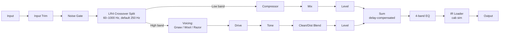

# Architecture

## Signal flow

Both bands re-converge at the `Sum` stage. The low band carries a compensation delay so it stays time-aligned with the oversampled high band (see [Latency compensation](#latency-compensation) below).

## Module map

| Directory | Responsibility |
|---|---|
| `src/dsp` | All audio-thread DSP: crossover (LR4 split/sum), gate, compressor, the three distortion voicings and their oversampling, EQ, IR loader/convolution, metering taps. No allocation, locks, or I/O once `prepareToPlay` has run. |
| `src/params` | Parameter layout and `AudioProcessorValueTreeState` definitions — parameter IDs, ranges, defaults, and value-to-DSP mapping. Single source of truth for what a preset captures. |
| `src/state` | Plugin state serialization: preset save/load, versioned state migration, `getStateInformation`/`setStateInformation` glue. Depends on `src/params` for what to persist, not on `src/dsp` directly. |
| `src/ui` | Editor/GUI code. Talks to the processor only through `src/params` (attachments) and read-only metering data — never reaches into `src/dsp` internals directly. Placeholder generic JUCE UI until the custom vector GUI lands in M6. |

Dependency direction is one-way: `src/ui` → `src/params` ← `src/state`, and `src/dsp` is driven by `src/params` values but has no upward dependency on UI or state code. This keeps the DSP core testable in isolation (see `tests/`) without instantiating any UI or persistence machinery.

## Latency compensation

The high band's distortion voicings run oversampled (to keep aliasing out of the nonlinear stages), which introduces processing latency that the low band does not incur. To keep the two bands phase-coherent at the `Sum` stage, the low band path carries a matching compensation delay sized to the high band's oversampling latency (filter group delay plus any oversampling-induced block delay), so both bands arrive at `Sum` with equal total latency. The plugin reports its total latency to the host via `setLatencySamples`, covering the crossover's own latency (if any, depending on implementation) plus the oversampling latency — so host-side plugin delay compensation (PDC) accounts for the whole chain, not just the high band in isolation. If the oversampling factor or voicing changes at runtime in a way that changes the latency, the reported latency is updated accordingly and the compensation delay is resized to match.
