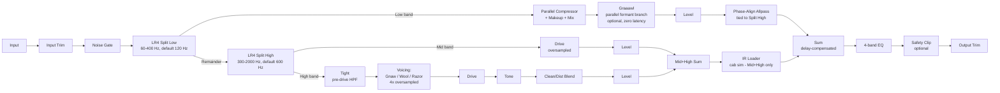

# Architecture

## Signal flow


```mermaid
flowchart LR
    IN[Input] --> TRIM[Input Trim]
    TRIM --> GATE[Noise Gate]
    GATE --> SPLIT1[LR4 Split Low<br/>60-400 Hz, default 120 Hz]

    SPLIT1 -->|Low band| LCOMP[Parallel Compressor<br/>+ Makeup + Mix]
    LCOMP --> LGROWL[Graaawl<br/>parallel formant branch<br/>optional, zero latency]
    LGROWL --> LLEVEL[Level]
    LLEVEL --> LALIGN[Phase-Align Allpass<br/>tied to Split High]

    SPLIT1 -->|Remainder| SPLIT2[LR4 Split High<br/>300-2000 Hz, default 600 Hz]

    SPLIT2 -->|Mid band| MDRIVE[Drive<br/>oversampled]
    MDRIVE --> MLEVEL[Level]

    SPLIT2 -->|High band| HTIGHT[Tight<br/>pre-drive HPF]
    HTIGHT --> HVOICE[Voicing:<br/>Gnaw / Wool / Razor<br/>4x oversampled]
    HVOICE --> HDRIVE[Drive]
    HDRIVE --> HTONE[Tone]
    HTONE --> HBLEND[Clean/Dist Blend]
    HBLEND --> HLEVEL[Level]

    MLEVEL --> MHSUM[Mid+High Sum]
    HLEVEL --> MHSUM
    MHSUM --> IR[IR Loader<br/>cab sim - Mid+High only]

    LALIGN --> SUM[Sum<br/>delay-compensated]
    IR --> SUM

    SUM --> EQ[4-band EQ]
    EQ --> CLIP[Safety Clip<br/>optional]
    CLIP --> OUT[Output Trim]
```

All three bands re-converge at the `Sum` stage. The Low band carries a compensation delay (matching the Mid/High branch's shared oversampling latency) and a phase-alignment allpass filter (see [Cascaded 3-band flat-sum](#cascaded-3-band-flat-sum-and-phase-alignment) below) so the three-way sum is both time-aligned and magnitude-flat.

## Module map

| Directory | Responsibility |
|---|---|
| `src/dsp` | All audio-thread DSP, each in its own class with a matching Catch2 test file: `Crossover` (LR4 split/sum, two cascaded instances - `lowSplit`, `midHighSplit`), `PhaseAlignFilter` (Low-band phase-alignment allpass - see below), `NoiseGateStage` (full-band input gate), `ParallelCompressor` (low-band dynamics), `MidBand` (mid-band staged drive, NEW in v0.2.0), `Voicing` (high-band Gnaw/Wool/Razor distortion + Tight pre-drive HPF + 4x oversampling + tone + blend), `BandEQ` (post-sum 4-band EQ), `IRLoader` (cab-sim convolution, relocated in v0.2.0 to the Mid+High branch), `SplitGap` (pure `clampSplitHighHz()` helper enforcing the minimum musical gap between the two crossover splits). **v0.3.0 adds** `ADAAShaper` (antiderivative antialiasing core, closed-form and tabulated), `CircuitDrive` (the Circuit engine: one shared oversampling region, OS-rate split, per-voicing circuit topologies), `LevelDetector` (log-domain RMS compressor detector with soft knee and program-dependent release), `GateEngine` (the Modern gate), `OutputClipper` (ADAA ceiling clip in delta form) and `MeterTaps` (lock-free metering). **v0.4.0 adds** `LowGrowl` (the Graaawl low-band growl branch - see below) and `FactoryIRs` (factory-IR slot mechanics and the licence guard). `RealtimeCoefficients.h` is a shared helper for updating `juce::dsp::IIR` filter coefficients from the audio thread without heap allocation (see below). No allocation, locks, or I/O once `prepareToPlay` has run. |
| `src/params` | Parameter layout and `AudioProcessorValueTreeState` definitions — parameter IDs, ranges, defaults, and value-to-DSP mapping. Single source of truth for what a preset captures. |
| `src/presets` | M2 preset system (`PresetManager`, `PresetBar`, `Localisation`) - see [Preset system](#preset-system-m2) below. |
| `src/gui` | The vector editor's component family, ported from `basilica-audio/Miserere`'s M3 editor: `BasilicaLookAndFeel` (palette, typography, knob/toggle/button painting, shared focus ring), `PointerKnob` (keyboard-operable rotary), `KeyboardSteps` (WAI-ARIA slider stepping), `BusPanel` (section faceplate + accessibility group) and `NeedleMeter` (two-scale vector meter). Talks to the processor only through `src/params` (attachments) and read-only metering data — never reaches into `src/dsp` internals directly. `src/PluginEditor.{h,cpp}` composes them. |

Dependency direction is one-way: `src/gui` → `src/params` ← `src/presets`, and `src/dsp` is driven by `src/params` values but has no upward dependency on UI, presets, or state code. This keeps the DSP core testable in isolation (see `tests/`) without instantiating any UI or persistence machinery.

## Graaawl: a generative, band-limited low-band growl (v0.4.0)

The Warwick Thumb growl is not low-frequency distortion. It is an asymmetric upper-mid character in roughly 700 Hz - 2.2 kHz with a formant-like resonance near 1 kHz, over a low end that stays tight. Shaping the fundamental directly produces intermodulation mud, so `LowGrowl` generates the character in a parallel branch and blends it on top of an untouched dry low band.

Two design points are worth recording, because both differ from the naive reading of the feature request:

**The harmonics are generated, not extracted.** The obvious sketch - highpass the low band at 300-400 Hz and shape what is left - cannot work here: this stage sits *inside* the Low band, below an LR4 split whose default is 120 Hz, so at 350 Hz there is nothing but 37 dB of stopband leakage. Instead the branch drives the fundamental into an asymmetric saturator (`tanh(g·x + b) − tanh(b)`, g = 6, b = 0.35) and then band-passes onto the formant window. For a 50 Hz fundamental that window is harmonics 14-44; the bias is what puts even harmonics there alongside the odd ones, which is the woody half of the character rather than pure grind. The band-pass sits *after* the shaper, and that - not a pre-filter - is what guarantees the sub is untouched.

**The branch is antialiased arithmetically, not by oversampling.** The nonlinearity is a moderate tanh fed by a band already lowpassed at 400 Hz or below, its output is band-limited before it reaches the sum, and ADAA-1 (`ADAAShaper.h`) takes another 20-30 dB off what remains. Measured alias-to-signal on a hot 50 Hz probe at full growl: −86 dB at Tone 0, −105 dB at Tone 100. That buys the property oversampling could not: **zero latency**, so enabling Graaawl never re-reports latency, never needs a compensating delay on the dry path, and the OFF state can be a structural bit-exact bypass (`process()` returns without touching the block once the gain ramp has reached zero) rather than an approximation.

Each band edge is a 4th-order Butterworth built from its own two pole-pair sections (Q = 0.5412 and Q = 1.3065) rather than two identical Q = 0.7071 sections, so the passband stays flat and the stated corners really are the −3 dB points.

## Factory IR slots and the licence guard (v0.4.0)

`FactoryIRs.{h,cpp}` is the mechanism for bundling cab IRs in the binary: an asset table of `{name, licence, source, bytes}`, a WAV/AIFF decoder that runs on the message thread, and `IRLoader::clearImpulseResponse()` for the slot list's "None" entry. The table the plugin ships is **empty** - no impulse response has been sourced with a licence worth staking a redistributed AGPLv3 binary on.

The licence bar is enforced in code rather than in a README: `FactoryIRLibrary`'s constructor drops any asset that does not name an approved licence (`CC0-1.0`, `Public Domain`, `Self-recorded`) *and* a non-empty checkable source, and counts the drops. `tests/FactoryIRTests.cpp` asserts that the shipped table loses nothing to that filter, so an IR added later without provenance fails the build instead of silently shipping. `resources/irs/LICENSES.md` is the human-readable half of the same record.

## Cascaded 3-band flat-sum and phase alignment

v0.2.0 restructures the signal path from a single 2-band LR4 split to two **cascaded** LR4 splits (Low, then Mid/High of the remainder) - see `docs/design-brief.md`'s Topology section for the design rationale. A single `cryp::Crossover`'s own dual-output Low+High sum is exactly a flat-magnitude allpass-filtered version of *that stage's own input* (`juce::dsp::LinkwitzRileyFilter`'s documented property). But naively cascading two such stages does **not** automatically make the three-way sum flat relative to the *original* input - confirmed empirically while building `tests/ThreeBandFlatSumTests.cpp`: deviations up to −10 dB appeared at close `splitLowHz`/`splitHighHz` ratios (worst inside the first crossover's own transition band), because the second crossover's own phase shift is applied only to the Mid+High branch, leaving the untouched Low band "out of phase" with it at the final sum.

The fix (`src/dsp/PhaseAlignFilter.h`) is proven algebraically, not just empirically: reading JUCE 8.0.14's own `juce_LinkwitzRileyFilter.cpp` source confirms the dual-output `processSample(channel, input, outputLow, outputHigh)`'s `outputLow + outputHigh` sum uses the *exact same formula* (built only from the first internal biquad stage's state) as that same class's single-output `processSample(channel, input)` in `Type::allpass` mode. Since that allpass transform is linear:

```
Low_compensated + Mid + High
  = Allpass2(Low) + Allpass2(Remainder)   [Mid+High = Allpass2(Remainder), by midHighSplit's own reconstruction property]
  = Allpass2(Low + Remainder)             [Allpass2 is linear]
  = Allpass2(Input)                       [Low + Remainder = Input exactly, lowSplit's own reconstruction property]
```

and `Allpass2(Input)` has flat magnitude relative to `Input` by definition (an allpass filter's magnitude response is unity at every frequency). `PhaseAlignFilter` wraps a *second, physically separate* `juce::dsp::LinkwitzRileyFilter<float>` instance configured `Type::allpass`, always tied to the *same* effective cutoff as `midHighSplit` (via `cryp::clampSplitHighHz()` - see below), applied to the Low band right after its own compressor+level processing, before the final sum. This is a standard technique in professional N-way active-crossover design (phase-alignment allpass networks between cascaded crossover stages), not a Crypta-specific invention.

## Minimum-gap clamp between Split Low and Split High

`splitLowHz`'s own range (60-400 Hz) overlaps `splitHighHz`'s own range (300-2000 Hz), so the two parameters could in principle collapse the Mid band to a degenerate near-zero (or inverted) width. `src/dsp/SplitGap.h`'s `cryp::clampSplitHighHz(splitLowHz, requestedSplitHighHz)` is a pure, real-time-safe function enforcing a minimum 1/3-octave gap: `midHighSplit` (and `lowBandPhaseAlign`, which must always match it exactly) are always set to `clampSplitHighHz()`'s *effective* value, never the raw `splitHighHz` parameter directly. `PluginProcessor`, the test suite, and the two DSP-level tests exercise the same function, so the boundary behaviour is directly testable (`tests/SplitGapTests.cpp`, `tests/ThreeBandFlatSumTests.cpp`).

## Real-time-safe filter coefficient updates

`juce::dsp::IIR::Coefficients<float>::makeLowShelf`/`makePeakFilter`/`makeHighShelf`/... (the usual way to build filter coefficients) heap-allocate a new `Coefficients` object on every call - fine in `prepareToPlay()`, not fine on the audio thread when a parameter (an EQ band's frequency, the high-band voicing's mid-filter, its tone or Tight control, ...) is being automated continuously. `BandEQ` and `Voicing` both use `juce::dsp::IIR::ArrayCoefficients<float>::makeXxx()` instead, which returns the same coefficients as a stack-only `std::array` (zero allocation), and `src/dsp/RealtimeCoefficients.h` writes that array's values directly into an already-allocated `Coefficients<float>` object's raw storage (normalising by `a0` the same way `Coefficients`' own constructor does). The `Coefficients` object itself is allocated exactly once, during `prepare()`; every subsequent update on the audio thread only ever overwrites existing memory.

## IR loader safe-by-default behaviour and relocation

`juce::dsp::Convolution` falls back to an internal single-sample identity impulse response when `loadImpulseResponse()` has never been called - but that fallback's assumed source sample rate is hardcoded to JUCE's `ProcessSpec` default (44100 Hz), so at any *other* session sample rate it would otherwise get silently resampled (smeared/attenuated) against a mismatched rate. `IRLoader::prepare()` closes that gap by explicitly loading a correctly-rate-tagged identity impulse response itself, so "no IR loaded" is a guaranteed bit-exact passthrough at every session sample rate, not only at 44100 Hz - see the class-level comment in `src/dsp/IRLoader.h`. This behaviour is unchanged in v0.2.0; what changed is *where* `IRLoader` sits in the signal path - it now processes only the Mid+High post-sum signal, structurally never the Low band (see `PluginProcessor.cpp`'s `processChunk()` and `tests/LowBandIsolationTests.cpp`, which asserts the Low band's own isolated output is bit-exact identical whether the IR loader is enabled or not).

## Latency compensation

The Mid band's staged drive (`cryp::MidBand`) and the High band's voicing (`cryp::Voicing`) each run their own nonlinear shaping stage oversampled 4x (`juce::dsp::Oversampling`, FIR half-band equiripple, max quality, integer latency) - two *physically separate* `juce::dsp::Oversampling` instances, identically configured (same factor exponent, same filter type), so their reported latencies are guaranteed numerically equal by construction even though they are not literally one shared object (see `src/dsp/MidBand.h`'s class docs for why literal instance-sharing was not implemented). This oversampling is the *only* source of latency in the current signal path - the gate, both crossovers, the phase-alignment allpass, the low-band parallel compressor, the EQ, and the IR loader (configured for zero-latency convolution) are all zero-latency by construction. To keep all three bands phase-coherent at the `Sum` stage:

- The Low band path carries a matching `juce::dsp::DelayLine` (integer/no-interpolation, since the delay is always a whole number of samples) sized to `juce::jmax(midBand.getLatencySamples(), highVoicing.getLatencySamples())`.
- The High band's own clean/distorted blend (`highBlend`) is handled by a `juce::dsp::DryWetMixer` whose dry path is *also* delay-compensated (`setWetLatency`) by that same amount, so the clean and distorted high-band signals stay phase-coherent with each other too, not just with the Low band. The Mid band has no blend control (see `src/dsp/MidBand.h`), so it needs no such compensation.

`CryptaAudioProcessor::computeTotalLatencySamples()` reports that shared value to the host via `setLatencySamples()`, so host-side plugin delay compensation (PDC) accounts for the whole chain.

### The `prepare()` priming gotcha (JUCE 8.0.14)

This applies to every smoothed `juce::dsp` stage in the chain, not only to the mixers - it was found on `DryWetMixer` first and cost a real defect on `juce::dsp::Gain` later (issue #98), so it is stated generally: **anything whose `prepare()` snaps a `SmoothedValue` must be told its value before `prepare()` runs, never after.**

`juce::dsp::DryWetMixer::prepare()` calls `reset()` internally, which snaps its smoothed dry/wet volumes to whatever `mix` was set to *at that moment* - so if `prepare()` runs before the real mix value is set, the mixer briefly snaps to a stale default before the next `setWetMixProportion()` call retargets it, causing an audible fade-in glitch on the very first block. `ParallelCompressor::prepare()`, `Voicing::prepare()`, and `IRLoader::prepare()` all take the current mix proportion as an explicit parameter and call `setWetMixProportion()` *before* `prepare()` internally, closing this gap at the API level rather than relying on call-order discipline at every call site. `MidBand` has no `DryWetMixer` (no blend control), so this gotcha does not apply to it.

`juce::dsp::Gain::prepare()` has exactly the same shape and was missed for longer. It calls `reset()`, which is `SmoothedValue::reset (sampleRate, rampDuration)`, and that snaps the smoother's *current* value to whatever *target* the object is holding at that instant. A default-constructed `juce::dsp::Gain` holds a target of `0.0` linear - silence, not unity - so a gain stage prepared before it is told the session's value ramps up from nothing across its whole ramp duration, while a *re*-prepared one (already holding the value) snaps straight to level. That made a freshly constructed instance render its first ~20 ms differently from a re-prepared one: a -13.5 dB null with a 0.485 peak difference on an otherwise neutral chain, and -13.5 dB of level on the opening 20 ms of a steady tone.

`CryptaAudioProcessor::prepareToPlay()` therefore sets the target on all five cascaded gain stages - input trim, the three per-band level trims, output trim - *before* calling `prepare()` on each, and `ParallelCompressor::prepare()` takes the initial makeup gain as an explicit parameter for the same reason it already takes the mix proportion. `reset()` needs no equivalent change: it also snaps current to target, and by the time a host can call it the target is already the session's value, so a mid-session transport stop or loop re-arms at level. `tests/OfflineRealtimeNullTests.cpp` asserts all three bring-up paths - prepared once, prepared twice, `reset()` before the first block - render bit-identically.

## Drive engines (v0.3.0)

`driveEngine` selects between two implementations of the Mid+High section.

**Classic** is the v0.2.0 code, unchanged: `cryp::MidBand` and `cryp::Voicing`, each owning its own 4x oversampling instance. It is preserved byte-for-byte because it is what every pre-v0.3.0 session and preset is migrated onto — `tests/GoldenRenderTests.cpp` renders committed v0.2.0 fixtures through the migrated processor and asserts sample-exact equality on macOS.

**Circuit** (`src/dsp/CircuitDrive.{h,cpp}`) collapses the two oversampling regions into one:

```
remainder (base rate)
  -> upsample once
  -> LR4 split #2, at fs*M          (cryp::Crossover, unchanged, prepared at fs*M)
  -> Mid:  ADAA tanh, dry-crossfaded by drive
     High: tight HPF -> per-voicing pre-emphasis -> ADAA clipper -> de-emphasis
           -> drive-tracked LPF -> DC blocker -> character -> tone -> blend
  -> per-band level -> sum -> downsample once
```

The saved oversampling region is what pays for the extra per-voicing filtering. The factor adapts to the host rate (4x ≤ 50 kHz, 2x ≤ 100 kHz, 1x above), on the basis that ADAA-1 contributes 20–30 dB of alias suppression on top of the oversampling headroom.

The High Bias offset that feeds the ADAA clipper never reaches the DC blocker as a static level: every voicing subtracts the clipper's response to the offset *on its own* at the point of creation (`f(offset)` — the `tanh(g·x + b) − tanh(b)` construction `cryp::LowGrowl` uses), and `CircuitDrive::reset()` primes each shaper's one-sample ADAA history at that operating point. So the 10 Hz blocker's quiescent input is zero at every bias setting — a state restored with High Bias at 100 % starts silent instead of thumping while the blocker settles (issue #34 item 4; measured 0.137 peak before, exactly 0.0 after, `tests/SilenceFloorTests.cpp`) — and what the blocker actually removes is the programme-dependent DC that asymmetric clipping of real signal produces, which no static subtraction can know.

Both engines stay prepared at all times, so switching is a branch rather than a reallocation. A switch arms a 256-sample constant-gain crossfade during which **both** engines run, and **flushes the incoming engine** first: only one engine runs at a time, so the idle one's oversampling history and delay lines otherwise hold stale audio and release it as a burst. The crossfade is longer than the brief's 64 samples because the flushed engine needs its own latency to refill before it can be given significant gain.

### Antialiasing

`src/dsp/ADAAShaper.h` implements first-order antiderivative antialiasing (Parker, Zavalishin & Le Bivic, DAFx-16): `y[n] = (F1(x[n]) − F1(x[n−1])) / (x[n] − x[n−1])`, with a midpoint fallback when consecutive inputs converge and the quotient becomes ill-conditioned. Closed forms are used where the antiderivative is elementary (tanh → ln cosh, hard clip → piecewise); otherwise a 2048-point cubic-interpolated table is built at prepare time, with `F1` obtained by Simpson integration of the sampled curve so the pair stays mutually consistent.

Two costs are inherent and accepted: a half-sample group delay (identical across Mid and High, so the bands stay aligned, and absorbed inside the oversampled region), and a mild `cos(pi*f/fs)` droop — which is why this is used *on top of* oversampling rather than instead of it.

## Latency across the two engines

The engines can have different intrinsic latencies, because Circuit's oversampling factor varies with the host rate while Classic is always 4x. Rather than re-report latency when `driveEngine` changes — which hosts handle poorly mid-transport, and which would make an automated engine switch shift the plugin's timing — `computeTotalLatencySamples()` returns the maximum across **both** engines and `circuitAlignDelay` pads the Circuit path up to it. Reported latency is therefore a function of the sample rate alone.

Note that the reported figure is the oversampling delay, not a full group-delay description: the Circuit high band contains IIR filters Classic does not (the 10 Hz DC blocker, the drive-tracked pole), so its reconstructed impulse peaks up to ~25 samples later. No single number can describe a frequency-dependent group delay; what is asserted instead is that reported latency matches across engines and rates, and that the three-way sum stays flat.

## The safety clip's delta form

`src/dsp/OutputClipper.h` applies ADAA to the clipper's **residual**, `r(x) = x − c·tanh(x/c)`, and returns `x − ADAA1_r(x)`.

The reason is that naive ADAA-1 of a function that is nearly linear over the segment degenerates to the two-tap average `(x[n] + x[n−1])/2` — a lowpass about −8.3 dB down at 18 kHz at 48 kHz, plus half a sample of delay, applied to the entire mix whenever the clip is merely armed. The delta form is algebraically `ADAA1(clip(x)) + (x[n] − x[n−1])/2`, i.e. the antialiased clipper plus an exact compensator for that droop and delay, so sub-ceiling material passes through transparently by construction.

That compensator is a first difference, and on fast material it can push a sample back over the ceiling (measured at 1.15 against a ceiling of 1.0). A final hard bound at the ceiling is therefore applied: it never engages below the ceiling, so transparency is untouched, and above it the ADAA has already done the antialiasing. At extreme overdrive the bound does cost the antialiasing advantage — the right priority ordering for a *safety* clip, with heavy clipping belonging to the drive stages.

## Metering

`src/dsp/MeterTaps.h` is a plain struct of `std::atomic<float>` — no FIFO, no queue, no allocation. The audio thread stores at block rate; the UI loads at 30 Hz. A meter is a most-recent-value display, so block-rate decimation is both sufficient and free, and a `static_assert` on `is_always_lock_free` keeps the audio thread from ever blocking on a reader. Both drive engines report their own per-band levels, since the Circuit engine's bands are summed inside its oversampled region and cannot be measured from outside.

## GUI (vector editor)

The editor is **100 % vector**: there are no PNG faceplates, knob filmstrips or needle sprites anywhere in this plugin (unlike the photoreal siblings in the suite). Every knob ring, lamp, panel, needle and glyph is drawn at runtime by `src/gui`, and the only embedded art is the EB Garamond typeface (`resources/fonts/`, OFL, embedded via `juce_add_binary_data`) — which makes the editor pixel-identical across macOS and Windows instead of inheriting a system serif.

**Layout.** Ten `BusPanel` sections, one per processing stage, in signal-flow order: Input, Noise Gate, Crossover, Low Band, Drive Engine, Mid Band, High Band, Cabinet, EQ, Output. They are grouped into three visual bands purely for layout; the *creation* order is always the signal-flow order, because JUCE's default focus traverser walks children in creation order and that is what defines the Tab sequence. The design size is not a literal: `PluginEditor.cpp` computes it from the layout constants plus the control tables, so adding a control cannot silently clip the window, and `tests/gui/EditorLayoutTests.cpp` asserts the resulting geometry (containment, no overlap, full parameter coverage) against the real component tree.

**Resizing and scale persistence.** Everything lives inside one `content` child laid out at the design size; resizing sets a uniform `AffineTransform::scale` on that child and nothing else. Layout arithmetic therefore cannot break at an odd window size — a property asserted directly (`tests/gui/EditorScaleTests.cpp` checks panel geometry is byte-identical before and after a resize). `setResizable (true, true)` attaches JUCE's `ResizableCornerComponent`; `setResizeLimits()` installs the default `ComponentBoundsConstrainer`, on which `setFixedAspectRatio()` locks the aspect. `AudioProcessorEditor::setScaleFactor()` is deliberately *not* used for the user's scale — in JUCE 8.0.14 it is the host's DPI channel and sets a transform on the editor itself, so keeping the user scale on the content child lets the two compose instead of overwriting each other. The chosen scale is persisted as a root-level property (`editorScale`) on the APVTS state tree, so it rides the existing `getStateInformation()`/`setStateInformation()` pair; JUCE's APVTS only reacts to property changes on its `PARAM` child trees, so a root property is inert for parameter handling.

**Metering.** One 30 Hz `juce::Timer` on the editor reads `cryp::MeterTaps`' relaxed atomics and pushes the values into four `NeedleMeter`s, which then run their own one-pole ballistics on the GUI thread. The meter component owns no timer of its own — the editor drives `tick (dt)` — so headless tests advance metering deterministically without a message loop. The peak scale uses fast-attack/slow-release constants (20 ms / 450 ms) so transients are visible at 30 Hz refresh; the gain-reduction scales are symmetric (180 ms) because the reading is meant to show the compressor's own ballistics, not add another envelope on top.

**Accessibility.** The suite's six-point standard, all of it test-enforced (`tests/gui/EditorAccessibilityTests.cpp`, `tests/gui/BasilicaLookAndFeelContrastTests.cpp`):

1. *Keyboard operability.* `juce::Slider` ships with `setWantsKeyboardFocus (false)` in JUCE 8.0.14, so `PointerKnob` opts back in; `KeyboardSteps.h` then replaces the stock stepping, which uses the parameter's raw interval (0.01 dB here — thousands of presses for a sweep) and refuses any modifier. Arrow = 1 % of range, Shift+Arrow = 0.1 %, PageUp/Down = 10 %, Home/End = extremes, all taken in the slider's *proportional* domain so skewed and log ranges sweep uniformly; choice knobs fall back to exactly one detent per press.
2. *Focus visible.* `LookAndFeel_V4` draws no usable focus cue on dark faces (and none at all for toggles), so `paintFocusRing()` draws a gold ring over a dark halo on knobs, toggles and preset-bar buttons.
3. *Name, role and value.* Every control carries a title matching its painted label (WCAG 2.5.3), toggles are real `juce::ToggleButton`s (reported as `toggleButton` roles), and knob value strings carry their unit. The unit suffix is installed **after** the `SliderAttachment` is constructed: JUCE 8.0.14's `SliderParameterAttachment` constructor assigns `slider.textFromValueFunction` itself, silently clobbering anything set before it.
4. *Focus order.* Equal to the signal flow, asserted through JUCE's real keyboard focus traverser rather than a re-derivation of child order.
5. *Grouping without trapping.* Each `BusPanel` is a `FocusContainerType::focusContainer` (accessibility grouping — a screen reader announces "Low Band, Ratio") but deliberately *not* a keyboard focus container, which would trap Tab inside one section.
6. *Contrast.* Every rendered text pair is fetched from `BasilicaLookAndFeel`'s static colour accessors — the same ones the painting code uses, never a second hand-copied literal — and asserted at WCAG AA 4.5:1. The peak meters' over-level state is carried by needle *position* as well as colour, so it does not depend on hue perception.

Headless testing note: the tests call `Component::createAccessibilityHandler()` directly. `getAccessibilityHandler()` only returns a handler once a component has a live native peer, which a console test binary never has.

## Preset system (M2)

v0.2.0 adds the suite-wide M2 preset system (`.scaffold/specs/preset-system-m2.md`), copied from `basilica-audio/nave`'s pilot implementation (`docs/preset-system-notes.md` in that repo is the replication recipe) - `src/presets/PresetManager.{h,cpp}` and `src/presets/PresetBar.{h,cpp}` are portable, Crypta-agnostic classes; the only Crypta-specific glue is `PluginProcessor.cpp`'s `makePresetManagerConfig()`/`makeFactoryPresetAssets()` helpers and the nine `presets/factory/*.json` files (embedded via `juce_add_binary_data` as `CryptaBinaryData`, see `CMakeLists.txt`). `AudioProcessorValueTreeState` is the single source of truth for parameter values; `PresetManager` reads/writes it only through its public API and owns no parallel copy of state.

`PresetManager`'s only audio-thread-adjacent code is its `AudioProcessorValueTreeState::Listener::parameterChanged()` override (dirty-flag tracking), implemented as a single lock-free `std::atomic<bool>` store. Every other method (file I/O, JSON parsing, `juce::String`/`juce::var` allocation) is message-thread-only, called from the processor's constructor or from `PresetBar`'s UI callbacks - never from `processBlock()`.

The editor (`PluginEditor.cpp`) installs a German localisation frame (`resources/i18n/de.txt`, selected via `SystemStats::getUserLanguage()`) before constructing `PresetBar`, using the same `initLocalisationThenGetPresetManager()` helper-function pattern nave established (member initialisers run in declaration order regardless of the order they're written in the initialiser list, so the helper must be invoked from `presetBar`'s own initialiser expression, not the constructor body).

## State migration (schema v2, v0.3.0)

v0.3.0 adds three engine selectors whose APVTS defaults name the NEW engines, so a genuinely fresh instance boots into them. Saved work must not inherit that, and there are **two independent entry points** that both need covering:

1. **Sessions.** `getStateInformation()` stamps a `stateVersion` attribute on the APVTS root element; `setStateInformation()` injects the legacy value for any of the three IDs a state without that attribute fails to mention. It runs after the v0.1 crossover migration, so a v0.1 session gets both in schema order.
2. **Presets.** Presets never pass through `setStateInformation()` at all. And because `applyParsedPreset()` calls `resetAllParametersToDefault()` before applying a preset's values, a legacy preset — which cannot name the new IDs — would otherwise adopt their new defaults. `PresetManagerConfig` gains a generic, version-gated legacy back-fill (`legacyParameterCutoffVersion` + `legacyParameterDefaults`), empty by default so the rest of the suite is unaffected. This is a read-side default-fill: the preset JSON schema, format tag and `parseAndValidate()` contract are all unchanged.

Both paths refuse to override a value that is explicitly present, and the preset path is gated on version rather than key presence — so a v0.3.0 preset that names one engine and omits the others keeps the new defaults for those, rather than being dragged back to legacy values.

`presets/factory/default.json` is the mechanism by which a fresh instance actually reaches the new engines (the constructor calls `applyStartupDefault()`, which loads it), so it pins all three explicitly and declares `pluginVersion` 0.3.0. The eight presets voiced against the v0.2.0 DSP pin Classic.

## State migration (v0.1.x → v0.2.0)

`CryptaAudioProcessor::setStateInformation()` runs a one-way, best-effort migration (`migrateLegacySingleCrossover()`, `PluginProcessor.cpp`) before handing state to `apvts.replaceState()`: a v0.1.x session's single `crossoverFreq` `PARAM` XML element (that parameter ID no longer exists in v0.2.0's `ParameterLayout`) is read directly out of the raw XML, clamped into `splitHighHz`'s new 300-2000 Hz range, and injected as a new `splitHighHz` `PARAM` element - unless one is already present (defensive, not expected from a genuine v1 or v2 session). Every other new v0.2.0 parameter (`splitLowHz`, `midDrive`, `midLevel`, `highTightHz`) simply falls back to its own `ParameterLayout` default via `AudioProcessorValueTreeState::replaceState()`'s existing "unmentioned parameter ID keeps its current/default value" behaviour - no special-case code needed for those. See `tests/StateMigrationTests.cpp` for the full test coverage, including the dedicated regression test asserting an untouched v0.1.x session (shipped default `crossoverFreq` = 250 Hz, below the new 300 Hz floor) lands exactly at 300 Hz.
